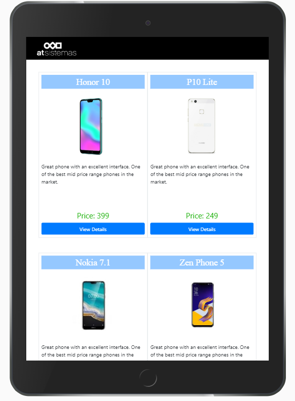
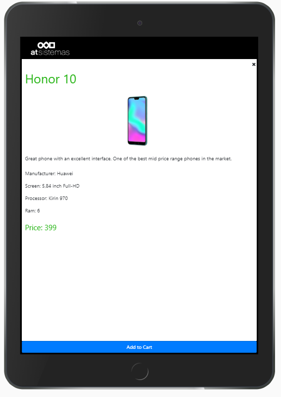
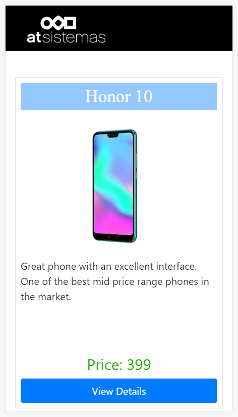
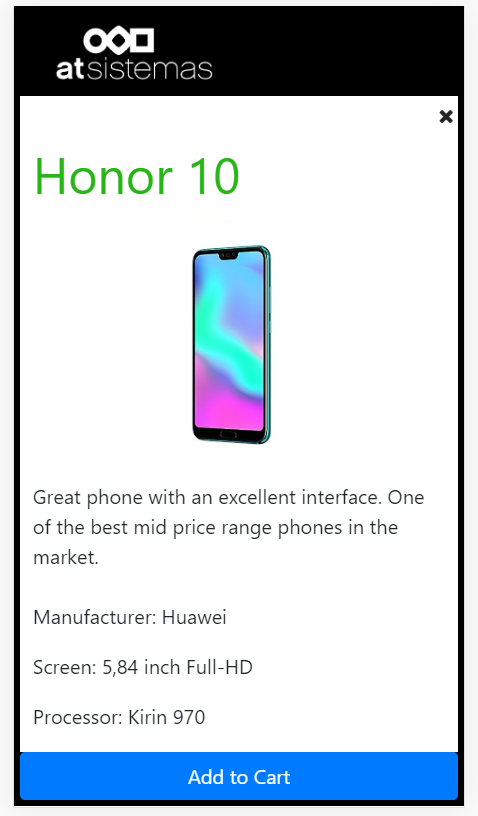
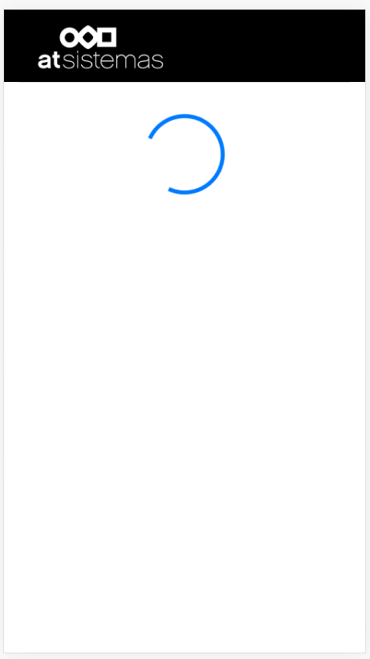
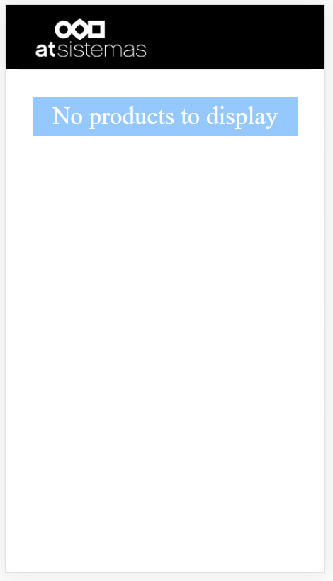
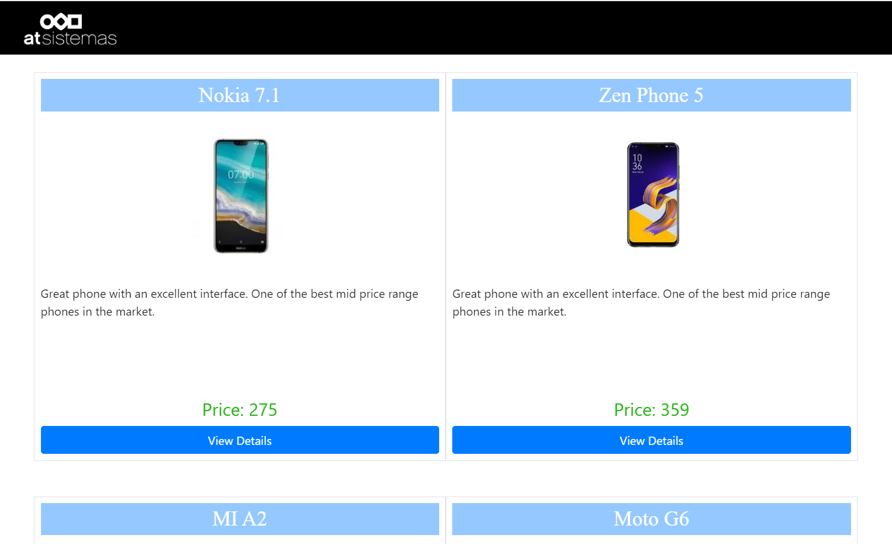

##### Phone Catalogue - React
By Mark Webley

Example of Custom: Architecture with React 16.13.1, Redux, Epics, Rxjs, Services, API end point control, node.js API, React Class example, React Hooks example, bootstrap / bootstrap flexbox, responsive, scss and more.

More focus was placed on the architecture, and communication between widgets then the UI design.

__Note:__ the following was not implemented because _the current lifecycle methods componentWillMount, componentWillReceiveProps, and componentWillUpdate will be deprecated in a future ReactJS 16.x release._

__TODO: unit tests | docker script.__

To install execute:
- npm i
- npm i -g nodemon
- npm run build;
- cd node-server
- npm i
- npm run build;

To run node server execute:
- npm run node:server
View API in the browser [http://localhost:3100/api/phones](http://localhost:3100/api/phones).

To run front end execute:
- npm start
View Front End in the browser [http://localhost:3000](http://localhost:3000).

Trouble shooting:
- if are not able to start the node server, make sure you kill existing running processes on port :3100

## Visuals

### IPAD/Tablet list view
 

### IPAD/Tablet detail view

### Mobile list view

### Mobile detail view

### Mobile view loader

### Mobile view when no data is available

### Desktop list view

In the project directory, you can run:

### `npm test`

Launches the test runner in the interactive watch mode. 
See the section about [running tests](https://facebook.github.io/create-react-app/docs/running-tests) for more information.

# Phone Catalogue
Your task is to write a very simple product catalogue app.

1. Write a simple REST API in whatever language you're most comfortable (NodeJS, Rails, Java...) that...
 - Has 1 endpoint `/phones`
 - Returns the attached "phones.json" payload (or a free version of it)
 - The data can all be mocked, no need for a persistence layer
2. Write a React app that displays the phones from the API
- Use redux for state management and Axios (or similar library) for fetching data from the API
- Display an initial list with all phones
- When a phone model is selected from the list, it will render a phone detail view displaying a few more details about that phone
- Display a spinner or placeholder component while the API request is ongoing
- Make it look decent. No need for super sophisticated design, but at a minimum, make it somewhat responsive so that it doesn’t look terrible on a mobile phone. Add images for each device.
3. Push the code to a public github repo with a README.md that explains how to run API & Frontend app

## Bonus points
1. Dockerize the app.
2. Write realistic unit/end-to-end tests.